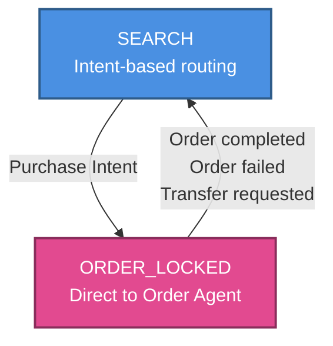

# Architecture

## 1. High-Level Overview

The `ecommerce-bot` is a Python-based conversational AI application designed to handle product inquiries and order processing. It employs a **Multi-Agent Architecture** orchestrated by LangChain and powered by OpenAI's GPT models.

### Core Technologies
-   **Language:** Python 3.12+
-   **Orchestration:** LangChain
-   **LLM:** OpenAI (GPT-4o-mini)
-   **Vector Database:** ChromaDB (Local)
-   **Relational Database:** SQLite (via SQLAlchemy)
-   **Dependency Management:** `uv`

## 2. Architecture Diagram


## 3. Component Architecture

### A. The Orchestrator (`src/agents/orchestrator.py`)
The central brain of the system. It acts as a router, directing user intents to specialized agents.
-   **Routing Logic:** Uses an LLM classifier to determine if a query is about "product search" or "placing an order".
-   **State Management:** Uses an enum-based state machine (`OrchestratorState`) to manage conversation flow:
    -   `SEARCH`: Default state, routes queries to appropriate agent based on intent classification
    -   `ORDER_LOCKED`: Locks the conversation to the Order Agent during an active transaction, preventing context switching until the order is complete or explicitly transferred
    -   State transitions are handled via `should_exit_order_mode()` which evaluates OrderAgent responses to determine when to return to `SEARCH` state

### B. Specialized Agents
1.  **RAG Agent (`src/agents/rag_agent.py`)**
    -   **Purpose:** Answers questions about products.
    -   **Mechanism:** Uses Retrieval-Augmented Generation (RAG). It queries ChromaDB to find relevant product chunks and synthesizes an answer.
    -   **Tools:** `retrieve_products`, `transfer_to_order_agent`.

2.  **Order Agent (`src/agents/order_agent.py`)**
    -   **Purpose:** Handles the checkout process.
    -   **Mechanism:** A stateful agent that collects user details, validates stock, and creates orders.
    -   **Tools:** `validate_product`, `create_order`, `transfer_to_rag_agent`.
    -   **Protocol:** Uses structured outputs (`OrderResponse`) to communicate status (`collecting_info`, `confirming`, `completed`) back to the orchestrator.

### C. Data Layer
1.  **Product Catalog (`src/database/products.py`)**
    -   **Source:** `data/products.json`.
    -   **Vector Store:** Manages embeddings in ChromaDB for semantic search.
2.  **Order Management (`src/database/orders.py`)**
    -   **Storage:** SQLite database (`data/ecommerce.db`).
    -   **ORM:** SQLAlchemy models for `Order` and `OrderItem`.

## 4. Data Flow

1.  **User Input** enters via `main.py` (CLI or Web UI).
2.  **main.py** passes input directly to `Orchestrator`.
3.  **Orchestrator** evaluates current state:
    -   **If state is `ORDER_LOCKED`**: Routes directly to **Order Agent** (bypasses intent classification).
    -   **If state is `SEARCH`**: Uses LLM classifier to determine intent:
        -   *Product Intent* -> **RAG Agent** -> Vector Search -> Response.
        -   *Purchase Intent* -> **Order Agent** -> Sets state to `ORDER_LOCKED` -> Validation -> Response.
4.  **Agents** return structured responses with status information.
5.  **Orchestrator** processes responses and updates state:
    -   Evaluates `OrderAgent` status via `should_exit_order_mode()`:
        -   Order completed/failed → Transition to `SEARCH`
        -   Transfer request to RAG → Transition to `SEARCH`
        -   Otherwise → Remain in `ORDER_LOCKED`
6.  **Orchestrator** formats and returns final response to user.

## 5. State Management Details

The orchestrator uses a simple enum-based state machine for conversation flow control:

```python
class OrchestratorState(str, Enum):
    SEARCH = "search"           # Default: routes based on intent
    ORDER_LOCKED = "order_locked"  # Locked: direct to Order Agent
```

**State Transition Diagram:**



**State Transitions:**
-   `SEARCH` → `ORDER_LOCKED`: When user expresses purchase intent
-   `ORDER_LOCKED` → `SEARCH`: When order completes, fails, or user requests transfer to search

**Benefits:**
-   Type-safe state management (enum prevents invalid states)
-   Clear state transitions with centralized logic
-   Better debugging (explicit state names in logs)
-   Easy to extend with additional states if needed
