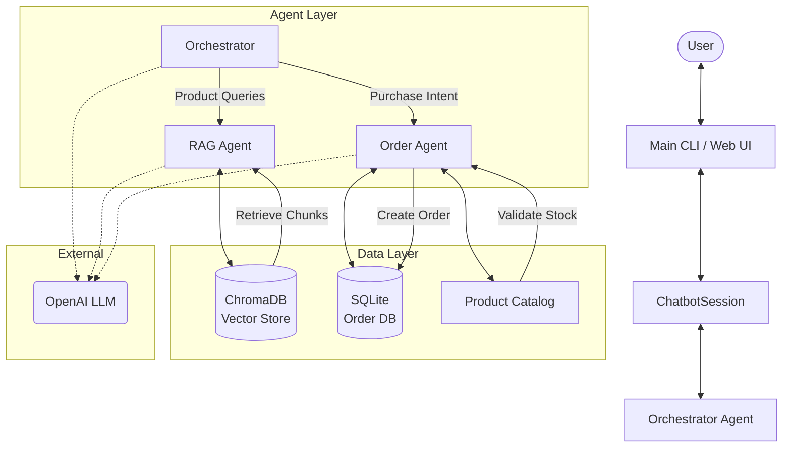

# Architecture

## 1. High-Level Overview

The `ecommerce-bot` is a Python-based conversational AI application designed to handle product inquiries and order processing. It employs a **Multi-Agent Architecture** orchestrated by LangChain and powered by OpenAI's GPT models.

### Core Technologies
-   **Language:** Python 3.12+
-   **Orchestration:** LangChain
-   **LLM:** OpenAI (GPT-4o-mini)
-   **Vector Database:** ChromaDB (Local)
-   **Relational Database:** SQLite (via SQLAlchemy)
-   **Dependency Management:** `uv`

## 2. Architecture Diagram

## 3. Component Architecture

### A. The Orchestrator (`src/agents/orchestrator.py`)
The central brain of the system. It acts as a router, directing user intents to specialized agents.
-   **Routing Logic:** Uses an LLM classifier to determine if a query is about "product search" or "placing an order".
-   **State Management:** Maintains a simple state flag `_in_order_mode` to lock the conversation to the Order Agent during a transaction, preventing context switching until the order is complete or explicitly transferred.

### B. Specialized Agents
1.  **RAG Agent (`src/agents/rag_agent.py`)**
    -   **Purpose:** Answers questions about products.
    -   **Mechanism:** Uses Retrieval-Augmented Generation (RAG). It queries ChromaDB to find relevant product chunks and synthesizes an answer.
    -   **Tools:** `retrieve_products`, `transfer_to_order_agent`.

2.  **Order Agent (`src/agents/order_agent.py`)**
    -   **Purpose:** Handles the checkout process.
    -   **Mechanism:** A stateful agent that collects user details, validates stock, and creates orders.
    -   **Tools:** `validate_product`, `create_order`, `transfer_to_rag_agent`.
    -   **Protocol:** Uses structured outputs (`OrderResponse`) to communicate status (`collecting_info`, `confirming`, `completed`) back to the orchestrator.

### C. Data Layer
1.  **Product Catalog (`src/database/products.py`)**
    -   **Source:** `data/products.json`.
    -   **Vector Store:** Manages embeddings in ChromaDB for semantic search.
2.  **Order Management (`src/database/orders.py`)**
    -   **Storage:** SQLite database (`data/ecommerce.db`).
    -   **ORM:** SQLAlchemy models for `Order` and `OrderItem`.

## 4. Data Flow

1.  **User Input** enters via `main.py` (CLI).
2.  **ChatbotSession** passes input to `Orchestrator`.
3.  **Orchestrator** evaluates context:
    -   If `_in_order_mode` is True: Directs to **Order Agent**.
    -   Else: Classifies intent.
        -   *Product Intent* -> **RAG Agent** -> Vector Search -> Response.
        -   *Purchase Intent* -> **Order Agent** -> Validation -> Response.
4.  **Agents** return structured responses.
5.  **Orchestrator** formats the final text and updates state (e.g., exiting order mode on completion).
