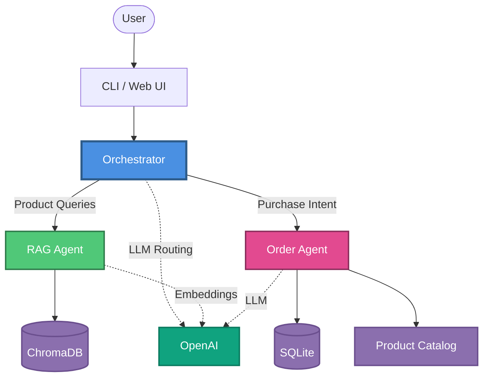
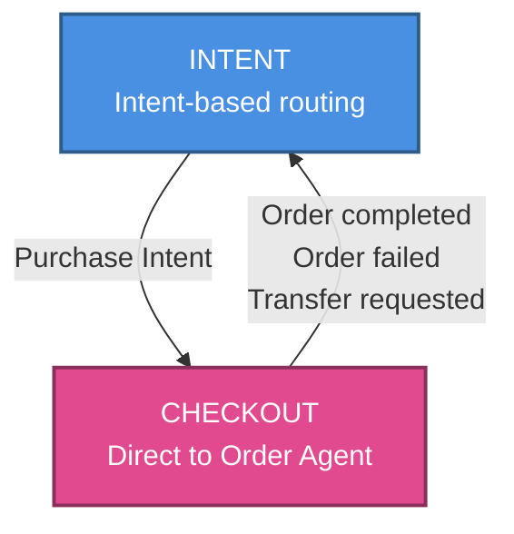

# Architecture

## 1. High-Level Overview

The `ecommerce-bot` is a Python-based conversational AI application designed to handle product inquiries and order processing. It employs a **Multi-Agent Architecture** orchestrated by LangChain and powered by OpenAI's GPT models.

### Core Technologies
-   **Language:** Python 3.12+
-   **Orchestration:** LangChain
-   **LLM:** OpenAI (GPT-4o-mini)
-   **Vector Database:** ChromaDB (Local)
-   **Relational Database:** SQLite (via SQLAlchemy)
-   **Dependency Management:** `uv`

## 2. Architecture Diagram



## 3. Component Architecture

### A. The Orchestrator (`src/agents/orchestrator.py`)
The central brain of the system. It acts as a router, directing user intents to specialized agents.
-   **Routing Logic:** Uses an LLM classifier to determine if a query is about "product search" or "placing an order".
-   **State Management:** Uses an enum-based state machine (`OrchestratorState`) to manage conversation flow:
    -   `INTENT`: Default state, routes queries to appropriate agent based on intent classification
    -   `CHECKOUT`: Locks the conversation to the Order Agent during an active transaction, preventing context switching until the order is complete or explicitly transferred
    -   State transitions are handled via `should_exit_checkout_mode()` which evaluates OrderAgent responses to determine when to return to `INTENT` state
-   **Cart Management:** Maintains an in-memory shopping cart (`self._cart`) as a list of cart items. The cart persists during the conversation session and is cleared after successful order creation. Cart items contain: `product_id`, `product_name`, `quantity`, `unit_price`.

### B. Specialized Agents
1.  **RAG Agent (`src/agents/rag_agent.py`)**
    -   **Purpose:** Answers questions about products.
    -   **Mechanism:** Uses Retrieval-Augmented Generation (RAG) with **hybrid search**:
        -   **Exact Match First:** Attempts exact matching by product ID or exact product name (case-insensitive)
        -   **Semantic Fallback:** If no exact match, performs semantic similarity search using ChromaDB vector embeddings
        -   This hybrid approach ensures precise results for known products while maintaining flexibility for natural language queries
    -   **Tools:** `retrieve_products`, `transfer_to_order_agent`.

2.  **Order Agent (`src/agents/order_agent.py`)**
    -   **Purpose:** Handles the checkout process.
    -   **Mechanism:** A stateful agent that collects user details, validates stock, and creates orders.
    -   **Tools:** `add_to_cart`, `remove_from_cart`, `view_cart`, `create_order`, `transfer_to_rag_agent`.
    -   **Cart Management:** Uses an in-memory cart (stored in Orchestrator) to track items before checkout.
    -   **Protocol:** Uses structured outputs (`OrderResponse`) to communicate status (`collecting_info`, `confirming`, `completed`) back to the orchestrator.

### Chat History Strategy

The agents have different requirements for conversation history, which affects how the Orchestrator passes context during agent handovers:

| Agent | Needs History? | Reason |
|-------|----------------|--------|
| **RAG Agent** | ❌ No | Stateless product search. Each query is independent—the agent only needs the current search query to find products. |
| **Order Agent** | ✅ Yes | Stateful multi-turn conversation. Requires history to: (1) find product IDs from previous listings, (2) collect customer info across turns, (3) understand follow-up responses like "yes", "2", or addresses. |

**Implementation:**
-   When routing to **Order Agent**: Full `chat_history` is passed to maintain conversational context.
-   When transferring from Order → **RAG Agent**: Empty `chat_history=[]` is passed to avoid LLM timeouts caused by processing large contexts with verbose product listings. The RAG agent only needs the search query.

This design prevents timeout issues during agent handovers while ensuring each agent has the context it needs.

### C. Data Layer
1.  **Product Catalog (`src/database/products.py`)**
    -   **Source:** `data/products.json`.
    -   **Exact Matching:** Provides exact product lookup by ID or name for precise queries.
    -   **Vector Store:** Manages embeddings in ChromaDB for semantic similarity search.
    -   **Hybrid Search:** The RAG agent combines both approaches - exact matching for known products, semantic search for natural language queries.
2.  **Order Management (`src/database/orders.py`)**
    -   **Storage:** SQLite database (`data/ecommerce.db`).
    -   **ORM:** SQLAlchemy models for `Order` and `OrderItem`.

## 4. Data Flow

1.  **User Input** enters via `main.py` (CLI or Web UI).
2.  **main.py** passes input directly to `Orchestrator`.
3.  **Orchestrator** evaluates current state:
    -   **If state is `CHECKOUT`**: Routes directly to **Order Agent** (bypasses intent classification).
    -   **If state is `INTENT`**: Uses LLM classifier to determine intent:
        -   *Product Intent* -> **RAG Agent** -> Hybrid Search (exact match first, then semantic) -> Response.
        -   *Purchase Intent* -> **Order Agent** -> Sets state to `CHECKOUT` -> Cart operations -> Response.
4.  **Order Agent** processes purchase requests:
    -   Uses `add_to_cart` to validate and store items in Orchestrator's cart
    -   Uses `view_cart` to show cart contents when requested
    -   Collects customer information (name, email, address)
    -   Uses `create_order` which reads from cart and clears it after success
5.  **Agents** return structured responses with status information.
6.  **Orchestrator** processes responses and updates state:
    -   Evaluates `OrderAgent` status via `should_exit_checkout_mode()`:
        -   Order completed/failed → Transition to `INTENT` (cart cleared on success)
        -   Transfer request to RAG → Transition to `INTENT` (cart preserved)
        -   Otherwise → Remain in `CHECKOUT`
7.  **Orchestrator** formats and returns final response to user.

## 5. State Management Details

The orchestrator uses a simple enum-based state machine for conversation flow control:

```python
class OrchestratorState(str, Enum):
    INTENT = "intent"           # Default: routes based on intent
    CHECKOUT = "checkout"  # Locked: direct to Order Agent
```

**State Transition Diagram:**



**State Transitions:**
-   `INTENT` → `CHECKOUT`: When user expresses purchase intent
-   `CHECKOUT` → `INTENT`: When order completes, fails, or user requests transfer to search

**Benefits:**
-   Type-safe state management (enum prevents invalid states)
-   Clear state transitions with centralized logic
-   Better debugging (explicit state names in logs)
-   Easy to extend with additional states if needed

## 6. Cart Architecture & Tradeoffs

### Cart Implementation

The system uses an **in-memory cart** stored in the Orchestrator (`self._cart`). This cart is:
-   **Session-scoped:** Persists during the conversation, cleared when order completes
-   **Simple structure:** List of dictionaries with `product_id`, `product_name`, `quantity`, `unit_price`
-   **Shared with Order Agent:** Cart reference is passed to Order Agent, allowing direct manipulation

### Cart Tools

The Order Agent provides four cart-related tools:

1.  **`add_to_cart(product_id, quantity)`**
    -   Validates product (existence, availability, stock)
    -   Adds item to cart or updates quantity if already present
    -   Returns success message or validation error

2.  **`remove_from_cart(product_id)`**
    -   Removes an item from the cart
    -   Returns confirmation message or error if item not found

3.  **`view_cart()`**
    -   Displays current cart contents
    -   Shows items, quantities, prices, and total
    -   Returns formatted cart summary

4.  **`create_order(customer_name, email, shipping_address)`**
    -   Reads items directly from cart (no items parameter needed)
    -   Validates all items are still available
    -   Creates order in database
    -   Clears cart after successful creation

### Architecture Tradeoffs: In-Memory Cart vs. History-Based

The in-memory cart approach was chosen over relying on LLM conversation history for these reasons:

**Key Benefits:**
-   **Reliability:** Prevents LLM from forgetting items or getting quantities wrong when handling multiple products
-   **Simpler order creation:** Direct read from cart instead of reconstructing items from conversation history
-   **Better UX:** Users can explicitly view their cart (`view_cart`) and remove items (`remove_from_cart`)
-   **Easier debugging:** Cart state is inspectable, making issues easier to diagnose

**Tradeoffs:**
-   **Session-only:** Cart is lost when conversation ends (acceptable for single-session purchases)
-   **Slightly more code:** Requires cart management tools, but adds minimal complexity

The history-based approach was not chosen because LLM memory is unreliable for tracking multiple cart items, and reconstructing the cart from conversation history for `create_order` is error-prone.
